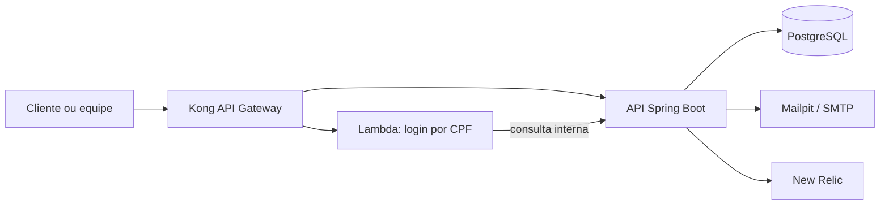

# API da Oficina Mecânica

Aplicação principal do Tech Challenge - Fase 3. Esta API REST gerencia clientes, veículos, estoque, catálogo de serviços e o ciclo de vida das ordens de serviço (OS). Ela é executada em Kubernetes no ambiente de nuvem e usa PostgreSQL gerenciado; para desenvolvimento, o `docker compose` fornece dependências locais equivalentes.

## Visão do repositório



O Kong é o ponto de entrada das rotas expostas. A API aplica autenticação JWT e autorização por perfil. O login por CPF é atendido pela Lambda do repositório específico, que consulta internamente o status do cliente e emite um JWT compatível. Eventos de OS e de estoque geram notificações assíncronas; logs, health checks e eventos de negócio são enviados ao New Relic quando configurado.

## Tecnologias

- Java 21, Spring Boot 4, Spring Security, JWT e Spring Data JPA/Hibernate;
- PostgreSQL 17 no ambiente local e PostgreSQL RDS no ambiente gerenciado;
- Docker, Docker Compose e Kubernetes;
- Kong, Mailpit, OpenAPI/Swagger e New Relic.

## Pré-requisitos

Para executar localmente: Docker Desktop com Docker Compose. Para executar sem containers: JDK 21 e Maven. O arquivo `.env` contém as variáveis usadas pelo Compose; não publique chaves, senhas ou tokens reais.

## Execução local com Docker

```bash
git clone <URL_DO_REPOSITORIO>
cd mechanic-shop-pos-tech-challenger
docker compose up --build
```

| Serviço | Endereço |
|---|---|
| Gateway Kong (entrada da API) | `http://localhost:8000` |
| Swagger da aplicação | `http://localhost:8080/swagger-ui.html` |
| Health check | `http://localhost:8080/actuator/health` |
| Mailpit | `http://localhost:8025` |
| pgAdmin | `http://localhost:5050` |

Pare o ambiente com `docker compose down`. Para remover também o volume local do PostgreSQL, use `docker compose down -v` (isso apaga os dados locais).

## Execução sem Docker

Inicie um PostgreSQL acessível e informe `SPRING_DATASOURCE_URL`, `SPRING_DATASOURCE_USERNAME` e `SPRING_DATASOURCE_PASSWORD`. Em seguida:

```bash
./mvnw test
./mvnw spring-boot:run
```

No Windows, substitua `./mvnw` por `./mvnw.cmd`. Para gerar o pacote, execute `./mvnw package`.

## Uso da API

A documentação interativa está em [Swagger local](http://localhost:8080/swagger-ui.html). Primeiro obtenha um JWT em `POST /api/auth/login`; envie-o como `Authorization: Bearer <token>` nas rotas protegidas. As operações de OS seguem o fluxo `RECEIVED` → `DIAGNOSIS` → `PENDING_APPROVAL` → `IN_PROGRESS` → `COMPLETED` → `DELIVERED`, podendo ser canceladas durante a aprovação.

As rotas de cliente são adicionalmente protegidas pelo Kong. O login por CPF é `POST /functions/cpf-login` no gateway, com corpo `{"document":"CPF_SEM_MASCARA"}`. Para usá-lo localmente, a Lambda e sua integração com o Kong devem estar previamente implantadas; o Compose desta aplicação não cria recursos AWS.

## Implantação

O deploy depende dos outros repositórios da fase: primeiro a infraestrutura Kubernetes, depois o banco gerenciado, a Lambda e por fim os manifests da aplicação. Configure no cluster a imagem da aplicação, `JWT_SECRET`, `INTERNAL_API_SECRET`, credenciais do banco e, opcionalmente, `NEW_RELIC_LICENSE_KEY`. Os manifests Kubernetes, a configuração do Kong e os guias complementares estão em `k8s/` e `docs/`.

Este checkout não contém workflow de CI/CD versionado. Antes do deploy automatizado, adicione uma pipeline que execute testes e build da imagem em pull requests e publique/implante somente nas branches de homologação e produção, conforme o enunciado da Fase 3.

## Repositórios relacionados

- `mechanic-shop-pos-tech-challenger-lambda`: autenticação por CPF;
- `mechanic-shop-pos-tech-challenger-kubernetes`: VPC, EKS, Lambda de infraestrutura e observabilidade;
- `mechanic-shop-pos-tech-challenger-managed-database`: PostgreSQL RDS privado.
