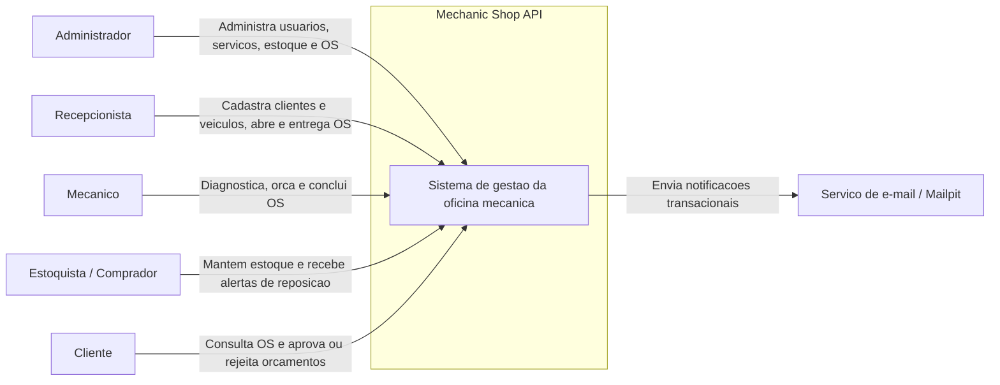
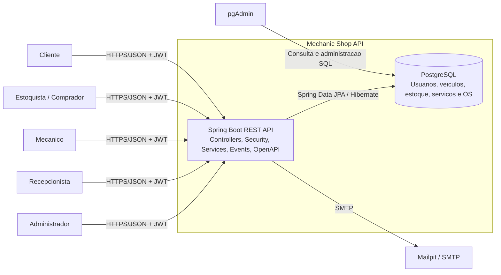
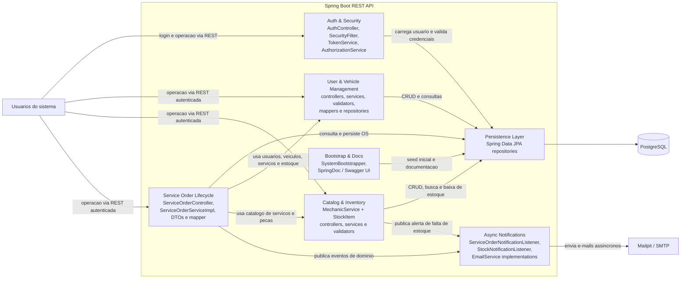
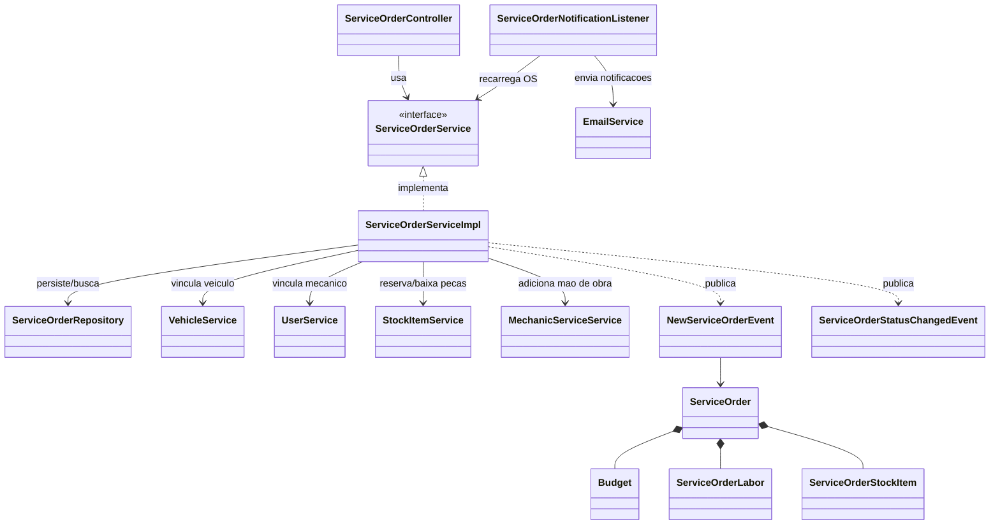

# C4 Model - Mechanic Shop API

Este documento descreve a arquitetura da aplicacao em quatro niveis do C4 Model, usando a implementacao real do projeto como fonte.

## Escopo

- Dominio principal: gestao de usuarios, veiculos, catalogo de servicos, estoque e ordens de servico.
- Estilo arquitetural: aplicacao monolitica Spring Boot, exposta via API REST.
- Principais preocupacoes arquiteturais: autenticacao JWT, controle de acesso por roles, persistencia relacional e notificacoes assincronas por e-mail.

## C1 - System Context

### Responsabilidades do sistema

- Centralizar a operacao da oficina mecanica.
- Controlar o ciclo de vida da ordem de servico.
- Gerenciar pecas, servicos e veiculos.
- Notificar clientes e equipe quando ha mudancas importantes no processo.

## C2 - Container

### Containers identificados

| Container | Tecnologia | Responsabilidade |
| --- | --- | --- |
| Spring Boot REST API | Java 21, Spring Boot, Spring Security, Spring Data JPA, SpringDoc | Expor endpoints REST, aplicar autenticacao/autorizacao, regras de negocio, eventos assincronos e documentacao Swagger. |
| PostgreSQL | PostgreSQL 17 | Persistir o estado operacional da oficina, incluindo usuarios, veiculos, estoque, catalogo e ordens de servico. |
| Mailpit / SMTP | Mailpit no ambiente local, SMTP configuravel | Receber notificacoes de novas OS, mudancas de status e alertas de estoque. |
| pgAdmin | pgAdmin 4 | Ferramenta operacional de apoio para inspecao e administracao do banco. |

## C3 - Componentes da Spring Boot REST API

### Componentes principais

| Componente | Principais classes | Responsabilidade |
| --- | --- | --- |
| Auth & Security | `AuthController`, `SecurityFilter`, `TokenService`, `AuthorizationService`, `SecurityConfigurations` | Login com JWT, validacao de token por request e protecao stateless dos endpoints. |
| User & Vehicle Management | `UserController`, `VehicleController`, services, validators, mappers e repositories | Cadastro e consulta de clientes, colaboradores e veiculos vinculados. |
| Catalog & Inventory | `MechanicServiceController`, `StockItemController`, `MechanicServiceServiceImpl`, `StockItemServiceImpl` | Cadastro do catalogo de servicos, manutencao do estoque e baixa de pecas durante a aprovacao do orcamento. |
| Service Order Lifecycle | `ServiceOrderController`, `ServiceOrderServiceImpl`, `ServiceOrderMapper` | Orquestrar o fluxo `RECEIVED -> DIAGNOSIS -> PENDING_APPROVAL -> IN_PROGRESS -> COMPLETED -> DELIVERED` e o cancelamento por rejeicao do orcamento. |
| Async Notifications | `ServiceOrderNotificationListener`, `StockNotificationListener`, `MockEmailServiceImpl`, `SmtpEmailServiceImpl` | Consumir eventos de dominio e enviar mensagens para cliente, mecanico, comprador e estoquista. |
| Persistence Layer | Repositories Spring Data JPA | Abstrair leitura e escrita das entidades persistidas. |
| Bootstrap & Docs | `SystemBootstrapper`, SpringDoc | Criar usuarios seed na subida da aplicacao e expor Swagger UI. |

## C4 - Codigo do componente Service Order Lifecycle

### Regras centrais desse componente

- A ordem de servico nasce em `RECEIVED`.
- Ao receber diagnostico/orcamento, a OS migra para `DIAGNOSIS`.
- Ao solicitar aprovacao do cliente, a OS vai para `PENDING_APPROVAL` e o `Budget` vai para `SENT`.
- Se o cliente aprovar, a aplicacao baixa estoque, marca o orcamento como `APPROVED` e move a OS para `IN_PROGRESS`.
- Se o cliente rejeitar, o orcamento vai para `REJECTED` e a OS vai para `CANCELED`.
- Conclusao tecnica move a OS para `COMPLETED`; entrega move para `DELIVERED`.
- As notificacoes de mudanca de status da OS sao disparadas apos `commit`, reduzindo acoplamento entre regra de negocio e integracao por e-mail.

## Observacoes arquiteturais

- A aplicacao e um monolito modular, o que simplifica o deploy e favorece consistencia transacional.
- O uso de eventos de dominio com `@Async` melhora desacoplamento para notificacoes, mas nao cria uma fila duravel.
- O banco de dados faz parte do sistema no nivel de container, mas os usuarios interagem apenas com a API.
- O Swagger UI nao aparece como container separado porque e servido pela propria aplicacao Spring Boot.
