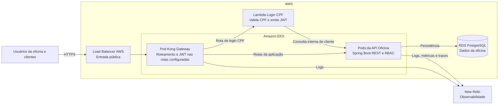

# Diagrama de Componentes da Arquitetura AWS

O diagrama apresenta os componentes funcionais e suas responsabilidades. Detalhes de implantação Kubernetes, como Pods, Services, ConfigMaps, Secrets e HPA, ficam fora desta visão para preservar a legibilidade.

## Leitura do diagrama

- **Há um único Load Balancer:** é o Load Balancer da AWS criado pelo `Service` Kubernetes do Kong. O Kong não é outro Load Balancer; ele é o gateway/reverse proxy que recebe o tráfego entregue pelo Load Balancer.
- **O AWS API Gateway continua no fluxo de CPF:** a rota de login entra pelo Kong e é encaminhada ao API Gateway, que invoca a Lambda. Isso mantém uma entrada pública única no Kong e, ao mesmo tempo, usa o API Gateway como integração exigida para a função serverless.
- **A API Spring Boot não é pública diretamente:** o Kong encaminha as rotas da aplicação para ela; a API continua responsável pela autorização RBAC e pelas regras de negócio.
- **ConfigMaps, Secrets, Services e Pods não são componentes de negócio:** são mecanismos de implantação. Eles devem aparecer apenas em um diagrama de implantação Kubernetes, se o grupo decidir produzir um adicional.

## Detalhes de implantação fora deste diagrama

- Kong e API Spring Boot executam em Deployments distintos no EKS.
- O `Service` do Kong é `LoadBalancer`; o `Service` da API é `ClusterIP`.
- ConfigMaps contêm configuração não sigilosa; Secrets contêm valores sensíveis, como credenciais do RDS, segredo JWT, segredo interno e chaves do New Relic.
- O HPA observa a API e ajusta suas réplicas conforme a métrica configurada de CPU.
